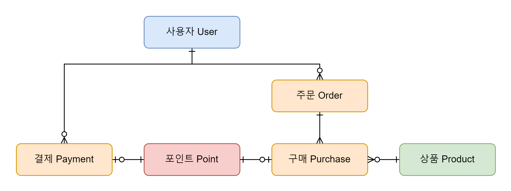

# phase
- 프로파일 버저닝
    - 로컬: `local`
    - 개발: `dev`
    - 스테이징: `stg`
    - 실: `prod`

- 스웨거: `/swagger-ui/index.html`
- 헬스체크: `/actuator/health`

# 비즈니스
- 이커머스

## 데이터 구조

### 사용자 User
- 결제, 구매 주체
- 객체 데이터

### 주문 Order
- 구매 묶음
- 로그성 데이터

### 구매 Purchase, 결제 Payment
- 포인트 일대일 선택 매핑
  - 구매는 음수 포인트 paid
  - 결제는 양수 포인트
- 로그성 데이터

### 포인트 Point
- 구매 재화
- 누적성 데이터 (증감 요소)

### 상품 Product
- 상품 정보 
- 마스터 데이터

### 재고 Stock
- 단일 상품 정보
- 구매와 일대일 매핑 가능
- 객체 데이터

